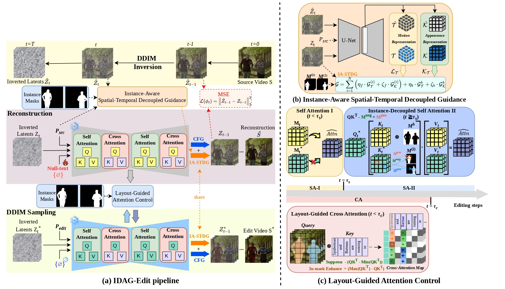

# IDAG_Edit: Multi-Object Video Editing via Instance-Decoupled Attention and Guidance (ICIP 2026)

Official implementation of **IDAG_Edit**, a *training-free* video editing framework that overcomes semantic leakage in multi-object video editing through instance-aware attention and guidance mechanisms.

Yuan-Zhih Lin, Huu-Thang Nguyen, Huu-Phu Do, Hong-Han Shuai, Ching-Chun Huang

Department of Computer Science, National Yang Ming Chiao Tung University Taiwan

<p align="center">
  <a href="https://louislin0128.github.io/IDAG_Edit_Page//" target="_blank">
    
  </a>
</p>

## Overview


---

## 🔧 Installations (python==3.11.14 recommended)

### Setup repository and conda environment

```
git clone https://github.com/nycu-acm/IDAG_Edit.git 
cd IDAG_Edit

conda env create -f environment.yaml
pip install torch==2.7.0+cu128 torchvision==0.22.0 --index-url https://download.pytorch.org/whl/cu128
conda activate IDAG_Edit
```
